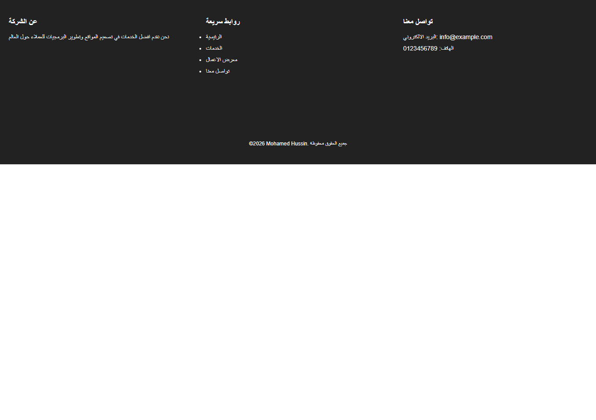

# 📄 Footer Section

مشروع Front-End لإنشاء **Footer احترافي** باستخدام HTML و CSS.

الهدف: عمل فوتر مرتب يحتوي على معلومات عن الشركة وروابط سريعة وطريقة للتواصل، مع تصميم متجاوب.

---

## 🚀 فكرة المشروع

المشروع يحتوي على:

- سكشن Footer  
- 3 أعمدة:  
  1. عن الشركة  
  2. روابط سريعة  
  3. تواصل معنا  
- روابط بتأثير Hover  
- نسخة نهائية © في الأسفل  
- تصميم Responsive باستخدام Flexbox و flex-wrap

---

## 🛠️ التقنيات المستخدمة

- HTML5  
- CSS3  
- Flexbox  

---

## 🎯 الخصائص المستخدمة في CSS

- margin  
- padding  
- box-sizing  
- font-family  
- display: flex  
- flex-wrap  
- justify-content  
- gap  
- max-width  
- min-width  
- text-align  
- color  
- background-color  
- font-size  
- transition  
- hover  

---

## 🧠 ماذا تعلمت من المشروع؟

- تنظيم أعمدة الفوتر باستخدام Flexbox  
- جعل الفوتر متجاوب باستخدام flex-wrap  
- استخدام gap للمسافات بين الأعمدة  
- إضافة تأثير Hover للروابط  
- استخدام padding و margin لتنظيم المسافات  
- استخدام min-width لتجنب كسر التصميم على الشاشات الصغيرة  
- تصميم نسخة نهائية © واضحة في أسفل الفوتر  

---

## 📂 هيكل المشروع
# 📄 Footer Section

مشروع Front-End لإنشاء **Footer احترافي** باستخدام HTML و CSS.

الهدف: عمل فوتر مرتب يحتوي على معلومات عن الشركة وروابط سريعة وطريقة للتواصل، مع تصميم متجاوب.

---

## 🚀 فكرة المشروع

المشروع يحتوي على:

- سكشن Footer  
- 3 أعمدة:  
  1. عن الشركة  
  2. روابط سريعة  
  3. تواصل معنا  
- روابط بتأثير Hover  
- نسخة نهائية © في الأسفل  
- تصميم Responsive باستخدام Flexbox و flex-wrap

---

## 🛠️ التقنيات المستخدمة

- HTML5  
- CSS3  
- Flexbox  

---

## 🎯 الخصائص المستخدمة في CSS

- margin  
- padding  
- box-sizing  
- font-family  
- display: flex  
- flex-wrap  
- justify-content  
- gap  
- max-width  
- min-width  
- text-align  
- color  
- background-color  
- font-size  
- transition  
- hover  

---

## 🧠 ماذا تعلمت من المشروع؟

- تنظيم أعمدة الفوتر باستخدام Flexbox  
- جعل الفوتر متجاوب باستخدام flex-wrap  
- استخدام gap للمسافات بين الأعمدة  
- إضافة تأثير Hover للروابط  
- استخدام padding و margin لتنظيم المسافات  
- استخدام min-width لتجنب كسر التصميم على الشاشات الصغيرة  
- تصميم نسخة نهائية © واضحة في أسفل الفوتر  

---

## 📂 هيكل المشروع
footer-section/
│── index.html
│── style.css
│── README.md

---

## 📷 صورة من المشروع

---

---

## ▶️ طريقة التشغيل

1. قم بتحميل المشروع.  
2. افتح ملف `index.html` في المتصفح.  
3. ستظهر صفحة الفوتر بالكامل مع الأعمدة والروابط.  

---

## 👨‍💻 المطور

Mohamed Hussin

---

⭐ مشروع تدريبي لتعلم إنشاء Footer احترافي باستخدام CSS.